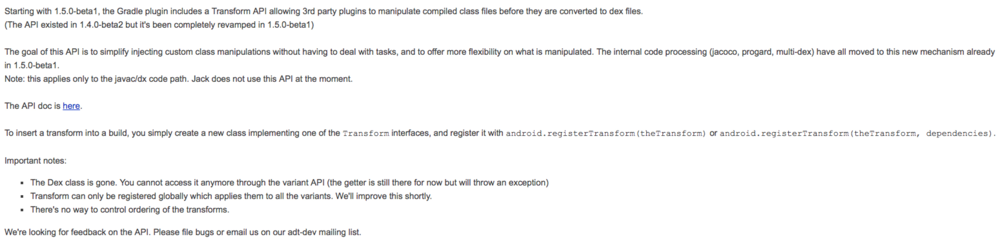

# 基于Gradle Transform 和 ASM 实现Android应用的AOP编程

### 前言
在这个大数据的时代，作为软件服务提供方会尽可能的去收集一些用户使用过程中的数据以便优化服务，Android平台作为目前用户量最大的一个载体为人们提供各种软件服务，因此在Android平台上的软件数据采集就显得尤为重要（在此我们先不讨论用户隐私和数据滥用的问题），但是一些传统的方式需要手动在代码中添加一些代码，当项目过大的情况下会发生遗漏，工作量大等情况发生，同时针对第三方提供的一些SDK服务我们无法添加代码的情况。幸好，在Android平台下我们可以借助一些其他的手段来完成此项工作，比如在编译期间扫描整个项目的class文件，在需要修改和添加的地方进行改动，此篇文章介绍了一种基于`gradle     transhform API`和字节码修改库`ASM`实现在Android中的AOP编程方式

### 认识Transform
先来看一下官方对于`Transform`的定义 
 

重点在于在 **能够处理dex之前的已经编译好的class文件**，**多个tansform之间执行无序**，**需要配合gradle插件使用**

那么回顾一下Android的编译过程

 
可以看见transform能发挥作用的地方就是在 `.class Files`这一步，它的每一次处理都是一个输入处理和输出的过程，并且输出地址不是由开发者任意指定的而是由输入内容、作用范围等因素由`TransformOutputProvider `提供的。

在代码中`Transform`是一个虚类
	
	public abstract class Transform {
    	public Transform() {
    	}

    	public abstract String getName();

    	public abstract Set<ContentType> getInputTypes();

    	public Set<ContentType> getOutputTypes() {
        	return this.getInputTypes();
    	}

    	public abstract Set<? super Scope> getScopes();

    	public Set<? super Scope> getReferencedScopes() {
        	return ImmutableSet.of();
    	}

    	/** @deprecated */
    	@Deprecated
    	public Collection<File> getSecondaryFileInputs() {
        	return ImmutableList.of();
    	}

    	public Collection<SecondaryFile> getSecondaryFiles() {
        	return ImmutableList.of();
    	}

    	public Collection<File> getSecondaryFileOutputs() {
        	return ImmutableList.of();
    	}

    	public Collection<File> getSecondaryDirectoryOutputs() {
        	return ImmutableList.of();
    	}

    	public Map<String, Object> getParameterInputs() {
        	return ImmutableMap.of();
    	}

    	public abstract boolean isIncremental();

    	/** @deprecated */
    	@Deprecated
    	public void transform(Context context, Collection<TransformInput> 	inputs, Collection<TransformInput> referencedInputs, 	TransformOutputProvider outputProvider, boolean isIncremental) throws 	IOException, TransformException, InterruptedException {
    	}

    	public void transform(TransformInvocation transformInvocation) throws 	TransformException, InterruptedException, IOException {
        	this.transform(transformInvocation.getContext(), 	transformInvocation.getInputs(), transformInvocation.getReferencedInputs(), transformInvocation.getOutputProvider(), transformInvocation.isIncremental());
    	}

    	public boolean isCacheable() {
        	return false;
    	}
	}
看到函数`transform`,我们还没有具体实现这个函数，这个函数就是具体如何处理输入和输出。`getScopes`函数定义了输入范围可以是整个项目所有类，也可以是自己项目中的类。

### 实现自定义Transform

我们在插件项目中(如何实现gradle插件请看另一篇[文章](https://github.com/carl1990/AndroidLearnBlog/tree/master/gralde%20%E6%8F%92%E4%BB%B6))集成Transform类实现transform方法

	    @Override
    void transform(TransformInvocation transformInvocation) throws TransformException, InterruptedException, IOException {
        this.transform(transformInvocation.getContext(), transformInvocation.getInputs(), transformInvocation.getReferencedInputs(), transformInvocation.getOutputProvider(), transformInvocation.isIncremental());
        //开始计算消耗的时间
        Logger.info("||=======================================================================================================")
        Logger.info("||                                                 开始计时                                               ")
        Logger.info("||=======================================================================================================")
        def startTime = System.currentTimeMillis()
        transformInvocation.getInputs().each {
            TransformInput input ->
                input.jarInputs.each {
                    JarInput jarInput ->
                        String destName = jarInput.file.name
                        /** 截取文件路径的md5值重命名输出文件,因为可能同名,会覆盖*/
                        def hexName = DigestUtils.md5Hex(jarInput.file.absolutePath).substring(0, 8)
                        if (destName.endsWith(".jar")) {
                            destName = destName.substring(0, destName.length() - 4)
                        }
                        /** 获得输出文件*/
                        File dest = transformInvocation.getOutputProvider().getContentLocation(destName + "_" + hexName, jarInput.contentTypes, jarInput.scopes, Format.JAR)
                        Logger.info("||-->开始遍历特定jar ${dest.absolutePath}")

                        def modifiedJar = modifyJarFile(jarInput.file, transformInvocation.context.getTemporaryDir())
                        Logger.info("||-->结束遍历特定jar ${dest.absolutePath}")
                        if (modifiedJar == null) {
                            modifiedJar = jarInput.file
                        }
                        FileUtils.copyFile(modifiedJar, dest)
                }

                input.directoryInputs.each {
                    DirectoryInput directoryInput ->
                        File dest = transformInvocation.getOutputProvider().getContentLocation(directoryInput.name, directoryInput.contentTypes, directoryInput.scopes, Format.DIRECTORY)
                        File dir = directoryInput.file
                        if (dir) {
                            HashMap<String, File> modifyMap = new HashMap<>()
                            dir.traverse(type: FileType.FILES, nameFilter: ~/.*\.class/) {
                                File classFile ->
                                    if (!name.endsWith("R.class")
                                            && !name.endsWith("BuildConfig.class")
                                            && !name.contains("R\$")) {
                                        File modified = modifyClassFile(dir, classFile, transformInvocation.context.getTemporaryDir())
                                        if (modified != null) {
                                            //key为相对路径
                                            modifyMap.put(classFile.absolutePath.replace(dir.absolutePath, ""), modified)
                                        }
                                    }

                            }
                            FileUtils.copyDirectory(directoryInput.file, dest)
                            modifyMap.entrySet().each {
                                Map.Entry<String, File> en ->
                                    File target = new File(dest.absolutePath + en.getKey())

                                    FileUtils.copyFile(en.getValue(), target)
                                    en.getValue().delete()

                            }
                        }
                }

        }
        //计算耗时
        def cost = (System.currentTimeMillis() - startTime) / 1000
        Logger.info("||=======================================================================================================")
        Logger.info("||                                       计时结束:费时${cost}秒                                           ")
        Logger.info("||=======================================================================================================")

    }
 在这个方法中我们分别遍历了jar包中的class文件和目录中的class文件，并查找到我们想要修改的类，对他进行读写、修改操作，也就是上文提到的 输入-->处理-->输出操作，在此期间所有的输入线相关信息由`TransformInput`提供，输出相关信息由`TransformOutputProvider`提供。具体的修改操作我将会在下一章节中讲到。

### Transform的使用
开始的时候我们就讲到Transform需要配合gradle插件使用，其实使用起来很简单，只需要把它注册在Plugin中就好了，在自定义的Plugin中的apply方法中：

	def android = project.extensions.getByType(AppExtension)
   	MyTransform myTransform = new MyTransform()
    android.registerTransform(myTransform)
    
   即可注册上该Transform
   
   
### ASM介绍
